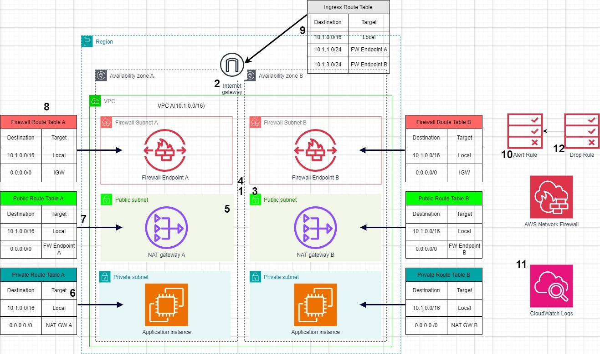

# 🛡️ Cloud Security: Threat Hunting with AWS Network Firewall

## Project Overview

In today's digital landscape, cloud security is paramount as organizations migrate their infrastructure to cloud-based platforms. This project focuses on enhancing security by leveraging **AWS Network Firewall** to detect and block unauthorized network activities. The primary objective is to prevent potential infiltration attempts, especially by detecting non-TLS (unencrypted) traffic over TLS ports, such as port 443.

## 📋 Objectives

1. **Create a Firewall Rule Group**: Detect non-TLS traffic traversing over TLS ports (e.g., port 443) to prevent malicious activity.
2. **Monitor Firewall Activity**: Utilize AWS Network Firewall monitoring and Amazon CloudWatch Logs to investigate and respond to suspicious network traffic.

## 🛠️ Solution Approach

### Scenario
Imagine a scenario where we've noticed suspicious unauthorized network activity, including potential infiltration attempts by hackers. The goal is to take immediate action to block their access and protect our confidential information.

### Solution
To address this issue:
- **Step 1**: Configure an AWS Network Firewall rule group to specifically detect non-TLS traffic over TLS ports (port 443).
- **Step 2**: Focus on detecting non-TLS TCP traffic traversing over port 443, helping us effectively identify and block potential infiltration attempts.
- **Step 3**: Monitor network activities using Amazon CloudWatch Logs for real-time alerts on any unauthorized access attempts.

This solution adds a strong defense layer to our network by filtering out malicious traffic and protecting sensitive data.

## 🚀 Steps Taken

1. **Configured AWS Network Firewall**:
   - Created firewall rule groups to detect suspicious traffic over port 443.
   - Integrated AWS CloudWatch Logs for comprehensive monitoring.

2. **Testing**:
   - Simulated non-TLS traffic within the network to verify detection.
   - Used `curl` and `openssl` commands to test legitimate and suspicious traffic scenarios.
   - Confirmed the firewall's effectiveness by monitoring CloudWatch logs for unauthorized access attempts.

## 🖼️ Architecture Diagram


## 🖼️ Diagram Explanation

1. **Distributed Deployment**: AWS Network Firewall is deployed in a distributed deployment model into each Virtual Private Cloud (VPC) that requires internet-bound traffic protection.
2. **VPC Overview**: The VPC serves as an isolated virtual network environment on AWS, connected to the internet through an internet gateway.
3. **Subnet Tiers**:
   - The VPC contains three subnet tiers: **firewall**, **public**, and **private** subnets.
   - Each subnet is associated with a route table to control traffic flow.
4. **Firewall Subnet**: AWS Network Firewall is deployed as a managed firewall in the firewall subnet using firewall endpoints.
5. **NAT Gateways**: Deployed in public subnets to provide outbound internet connectivity for resources in private subnets.
6. **Private Subnet Route Tables**: Direct outbound traffic to the NAT gateway.
7. **Public Subnet Route Tables**: Route incoming traffic to the Network Firewall endpoint for inspection.
8. **Firewall Subnet Route Table**: Routes all traffic to the internet gateway.
9. **Ingress Route Table**: Routes inbound traffic through the Network Firewall endpoint.
10. **Network Firewall Rule Groups**: Rules created to alert on suspicious traffic, such as non-TLS traffic over port 443.
11. **Logging with CloudWatch**: Network Firewall sends logs to Amazon CloudWatch Logs.
12. **Traffic Filtering**: Rule groups can be edited to drop suspicious traffic.

---

## 📝 Suricata Rule Strings

### Alert Rule
The following Suricata rule detects traffic on port 443 that is not using the TLS protocol:

```suricata
alert tcp any any <> any 443 (msg:"SURICATA Port 443 but not TLS"; flow:to_server,established; app-layer-protocol:!tls; sid:2271003; rev:1;)
```

### Drop Rule
The following Suricata rule drops traffic on port 443 that is not using the TLS protocol:

```suricata
drop tcp any any <> any 443 (msg:"SURICATA Port 443 but not TLS"; flow:to_server,established; app-layer-protocol:!tls; sid:2271003; rev:1;)
```

---

## 🧪 Test Simulation Commands

### Non-TLS Test
```bash
echo "Non-TLS test traffic" | nc -w 3 142.250.190.78 443
```

### HTTPS Request Test
```bash
curl -v https://www.example.com
```

### TLS Handshake Verification
```bash
openssl s_client -connect www.google.com:443
```

- **Expected Result**: Look for `Verify return code: 0 (ok)` to confirm a successful TLS handshake.

## 📊 Monitoring & Logs
AWS Network Firewall activity was logged and monitored using **Amazon CloudWatch**, providing insights into network traffic and potential threats.

## 🧑‍🤝‍🧑 Team Members

| Name                  | Role                    | ID            |
|-----------------------|-------------------------|---------------|
| Emmanuel Macaulay     | Cloud Security Engineer | FE/23/43836097 |
| Hadiza Oladipupo      | GRC Analyst             | FE/23/63922892 |
| Yinka Akintola        | CISO                    | FE/23/99525446 |
| Adu Olamilekan        | Network Administrator   | FE/23/81232810 |
| Sholanke Abayomi      | SOC Analyst             | FE/24/6766294920 |
| Adedamola Babafemi    | Penetration Tester      | FE/23/31535673 |
| Ayanbode Olanrewaju   | Cyber Security Engineer | FE/23/49305691 |

## 🔍 Future Recommendations

- Regularly update firewall rules to adapt to evolving threats.
- Establish incident response protocols for quicker reaction to suspicious activities.
- Utilize advanced monitoring tools for real-time threat detection and alerts.

## 📚 Resources
- [AWS Network Firewall Documentation](https://docs.aws.amazon.com/network-firewall/latest/developerguide/what-is-aws-network-firewall.html)
- [Amazon CloudWatch Logs](https://docs.aws.amazon.com/AmazonCloudWatch/latest/logs/WhatIsCloudWatchLogs.html)
